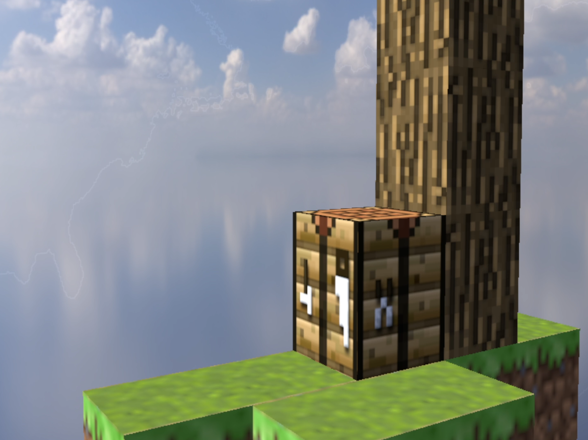
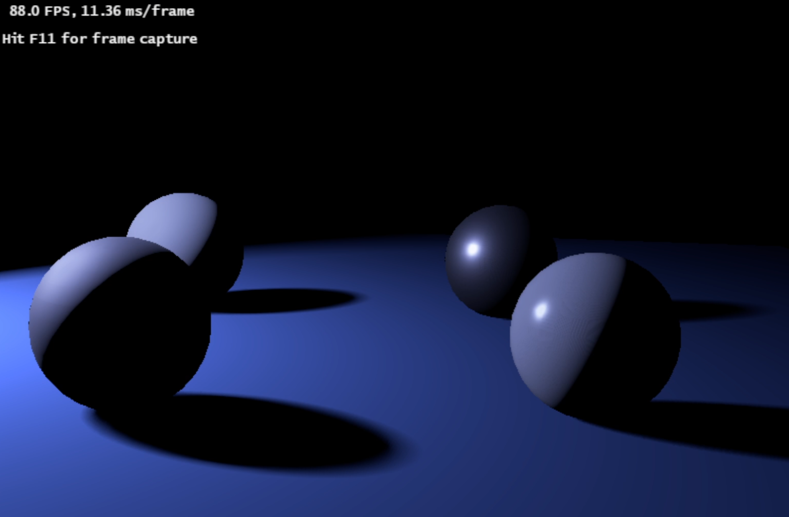
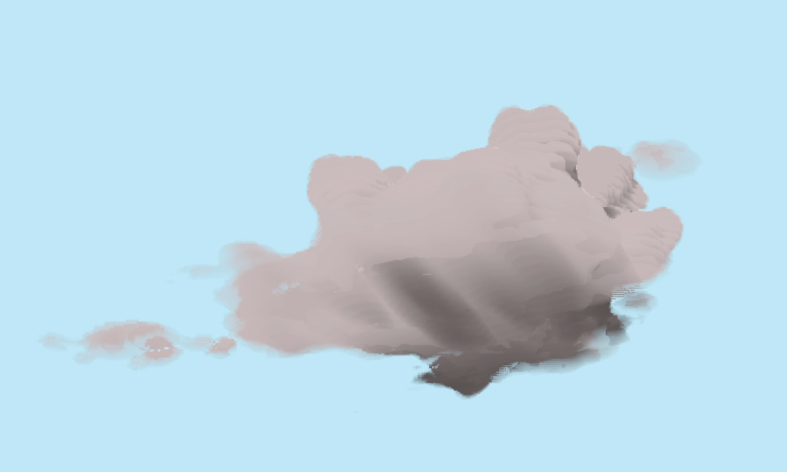

# Scene-Viewer

A real-time scene viewer, with Vulkan. Read blender file(.blend) as input, and generate a real-time view.

Implemented several features

## Basic Animation 

## Material Support

### Mirror

### Lambertian

### Texture with env-light [click to view video]

## Light & Shadow Support & Material(pbr) [click to view video]

### PCSS

## Voxel Rendering [click to view video]

