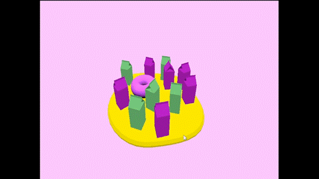
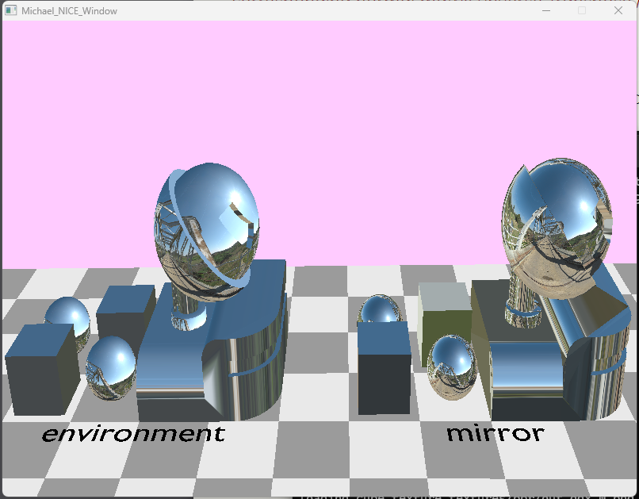
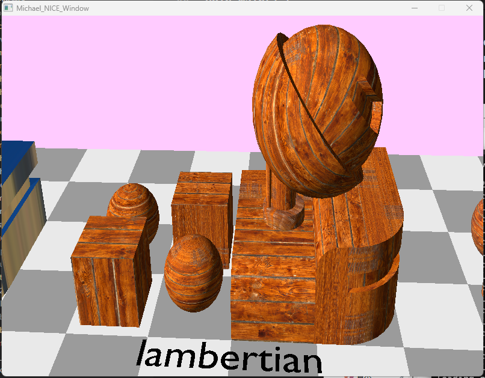
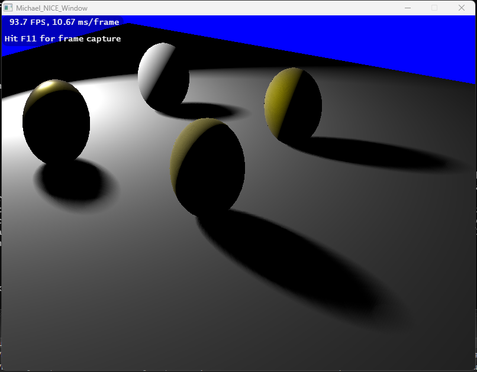

# Scene-Viewer

A real-time scene viewer, with Vulkan. Read blender file(.blend) as input, and generate a real-time view.

Implemented several features

## Basic Animation 

## Material Support

### Mirror

### Lambertian

### Texture with env-light
<video width="600" controls>
  <source src="./res/creation.mp4" type="video/mp4">
  Your browser does not support the video tag.
</video>

## Light & Shadow Support & Material(pbr)
<video width="600" controls>
  <source src="./res/light-with-shadow.mp4" type="video/mp4">
  Your browser does not support the video tag.
</video>

### PCSS

